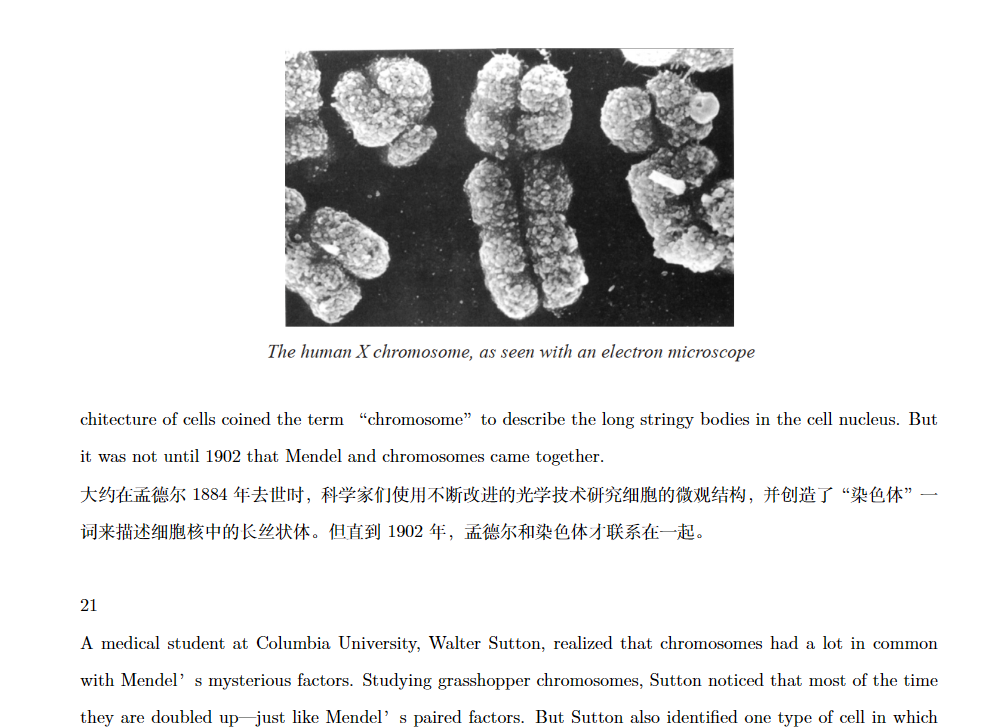

# GFN1000_Bilingual 🌟
**拯救英语苦手的GFN1000双语教材 | 卑微求star**

## 📖 项目背景
作为GFN1000课程的挣扎者，本人深刻理解阅读原版教材的痛苦：
- 英文原版看得怀疑人生 😵
- 现有中文版缺失小节序号，上课时找不到
- 只看中文的话英文quiz时宛如文盲 📚
- 中英对照才能保平安的学习刚需

## 🌟 项目特点
`中英对照` | `AI辅助翻译` | `持续更新` | `小节序号`


## ✨ 效果预览




## 📌 使用说明
### 文件结构
```
GFN1000_Bilingual
├── 📁 imgs # 效果预览图
├── 📁 Tex_files # 可编辑的LaTeX源文件（欢迎大佬改进！）
├── 📄 GFN1000_Bilingual.pdf # 可直接下载的全文成品
├── 📄 README.md
├── 📄 Text1.pdf # 可直接下载的单篇文章成品
├── 📄 Text2.pdf
├── 📄 ......
└── 📄 Text5.pdf
```

### 翻译说明
- **版本基准**：第二版（Second Edition, 2012）
- **翻译工具**：豆包 + Kimi + 本人破碎的英语水平
- **准确率警告**：AI翻译+人工校对（但校对时可能在赶due...）
- **更新节奏**：随课程进度周更（如果没鸽的话）

### 章节说明
| 章节 | 完成度 | 特别说明 |
|------|--------|----------|
| Text1 | ❓应该差不多全搞完了 |  |
| Text2 | ⚠️不完整 | 我们老师说后半部分quiz不考，所以偷懒了（理直气壮） |
| Text3 | ✅ 完整 |  |
| Text4 | ✅ 完整 |  |
| Text5 | ✅ 完整 | 新鲜出炉 |
| Text6 | ❌坐等有缘人帮我完成 |  |
| Text7 | ❌坐等有缘人帮我完成 |  |
| Text8 | ❌坐等有缘人帮我完成 | |
| Text9 | ❌坐等有缘人帮我完成 | |
| Text10 | ❌坐等有缘人帮我完成|  |
| Text11 | ❌坐等有缘人帮我完成 | |

## 🕒 最后更新
**2025年3月1日**

翻译进度：📚 5/11 篇

---

## 🙋 想对你说
> "这个项目最初只是我的自救指南，  
> 如果碰巧帮到你，请给我一颗star✨  
> ——来自某个深夜赶due的秃头学生"

**温馨提示**：
1. 发现翻译错误？欢迎提Issue！
2. 想参与改进？直接Fork走起！
3. 仅供课程学习所用，不要拿来干坏事
